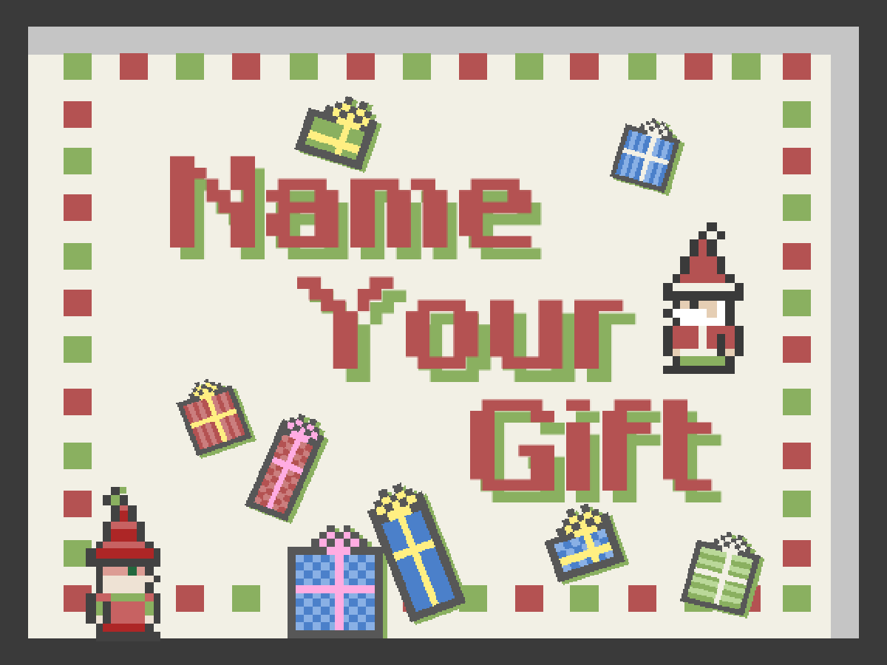

# 🎁前言

第一次从头到尾开发一款完整的h5小游戏，从策划、开发到上架一共花费了16天左右的时间，笔者从来没有接触过游戏行业，对游戏开发也处于摸索的初期，**这篇文章的写作目的，是记录我遇到的问题，和解决问题的思路。**

今天是2024年12月24日平安夜🎄，**祝大家圣诞节快乐，开开心心迎接2025🎉🎉🎉**！

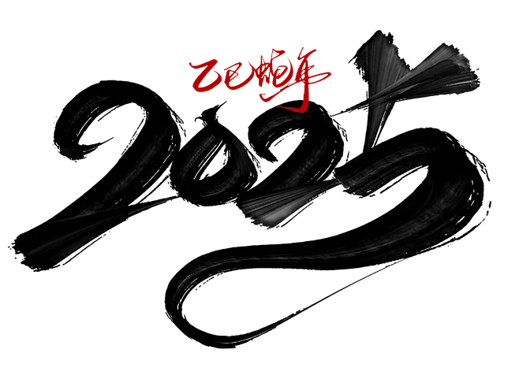
# 🎅游戏介绍

> *圣诞节前夕，**圣诞老人🎅**正在准备送给孩子们的礼盒，**收集散落在房间各处的材料打包成礼盒🎁**，找到**合适的送礼对象**，**按照他们的喜好**进行包装。*

[itch.io完整版游戏地址](https://electric-duck.itch.io/name-your-gift)

- **游戏名称：** Name Your Gift
- **中文名：** 求礼必应
- **支持语言：** 中文、英文
- **游玩时间：** 5-10min
- **平台：** PC
- **游玩设备：** 鼠标、键盘
- **运行平台：** 浏览器
- **游戏类型：** 2d平台跳跃、像素风格

### ✂️游戏截图


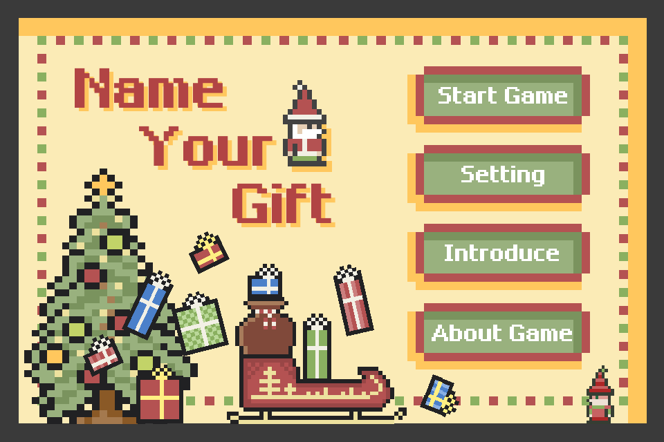

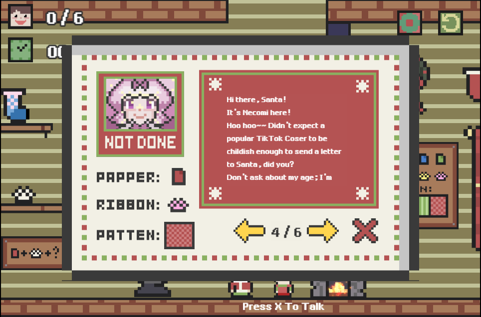

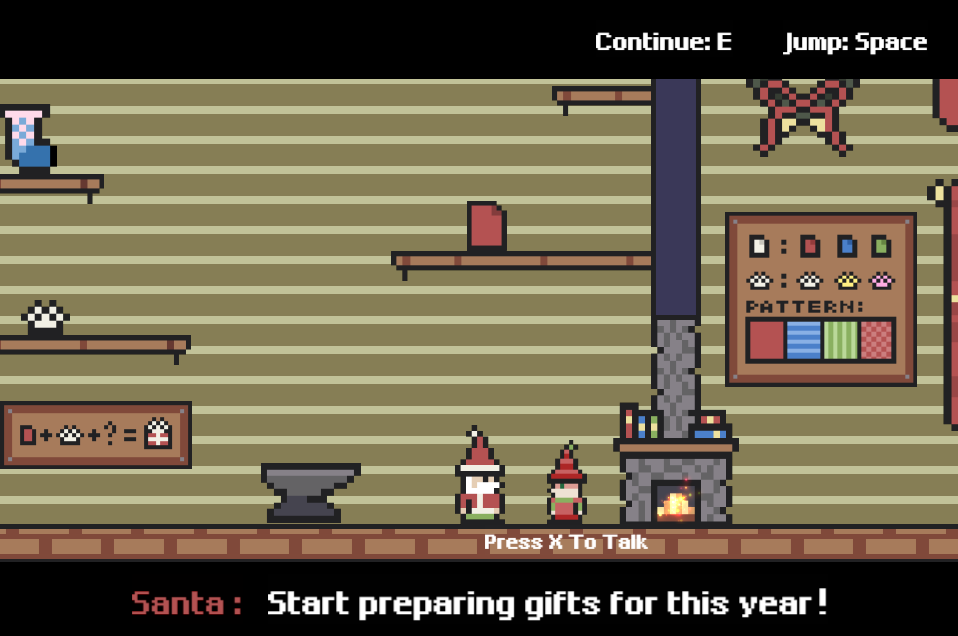

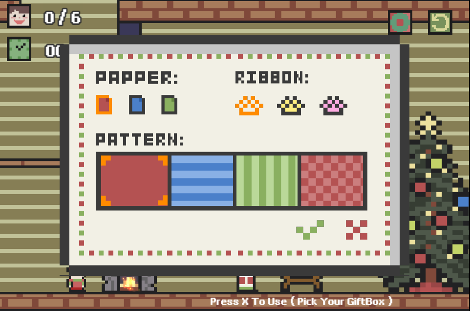

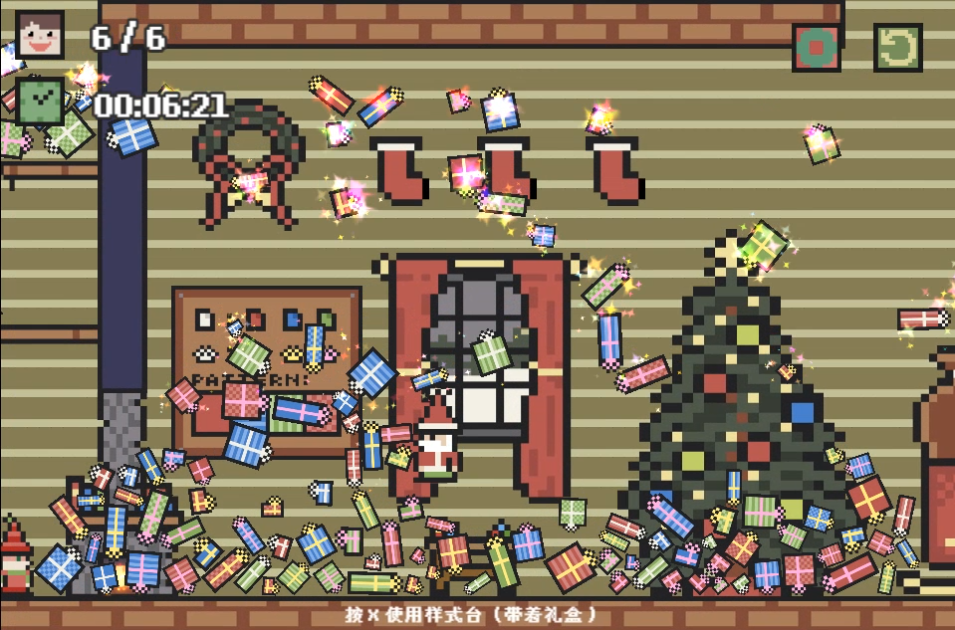


### 🎮操作规则

- ❄️使用**A/D/W**或者**←/→/↑**进行移动和跳跃
- ⛄️**E键**举起物品，**X键**与NPC或样式台进行交互，**Space键**跳过对话
- 🎁阅读孩子们寄来的**信件**，找到**适合他们的礼物**，按照他们的**喜好**进行包装
- 🛷将确认包装好的礼盒**丢到雪橇车中**


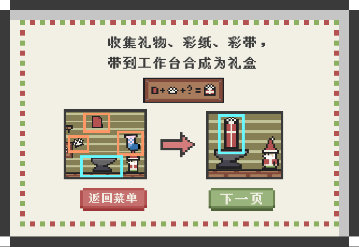

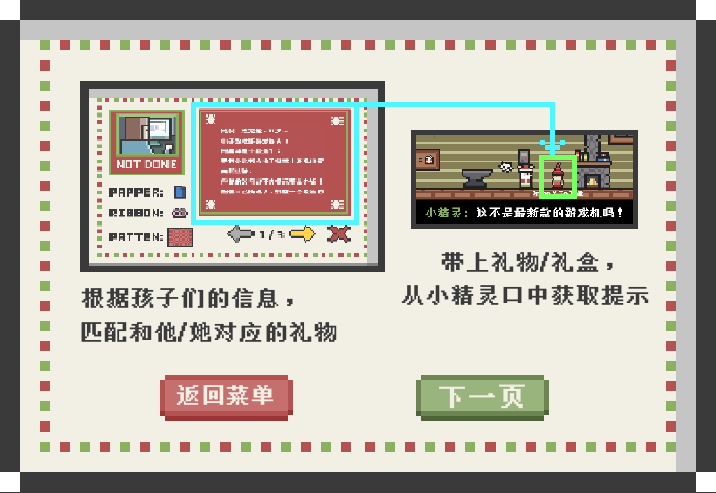

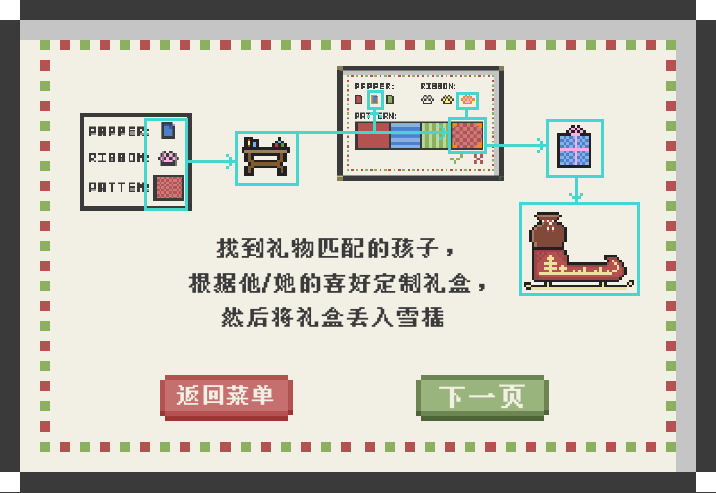

# 💻开发过程

## 📘第一步：策划

这里主要用几个问题作为切入点：

*1. 为什么要做这款游戏？*

*2. 这款游戏的核心玩法是什么？*

*3. 这款游戏希望达成的目标是什么？*

### *问题1：为什么要做这款游戏？*
**答：** 纯主观答案。

因为笔者平时比较喜欢打游戏，比较关注独立游戏与独游开发者，希望能加入这个行列，

笔者本职是Web前端工程师，只能靠下班后零碎时间学习游戏相关知识，

但无论怎么学，总觉得摸不到门路，于是**希望利用现在学到的东西，完完整整的做一款游戏，亲自实践一下，总结经验，为下一步的学习找到方向。**

### 问题2：这款游戏的核心玩法是什么？

**答：** 这款游戏实际上更像是一次**临摹**。
玩法上并没怎么设计，最初的想法是：*能利用现在学习到的东西，从头到脚制作出一款和圣诞节相关的游戏就行。*

临摹的对象是itch.io上的创作者[williambilliam的游戏作品festive-frenzy](https://williambilliam.itch.io/festive-frenzy)，2023年itch.io Christmas Game Jam的参赛获奖游戏。

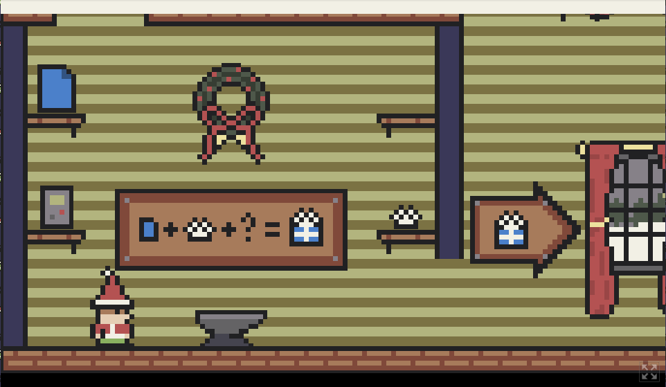
试玩之后觉得非常适合游戏开发上手。**这款游戏的玩法就是：** *收集制作礼盒需要的3样必备材料：彩纸、礼花、礼物，这些材料散落在地图的各处，把它们带到合成砧，合成为一个礼盒，然后丢到雪橇车内。将所有的礼盒都丢进雪橇内，即算游戏胜利。*

游戏玩法非常契合2023年Christmas Game Jam的特殊物品要求：**砧**。

但如果仅限于此，玩法似乎过于单调，与此同时我又玩了另一款小游戏：[itch.io上创作者duzda的游戏作品santa-says](https://duzda.itch.io/santa-says)。

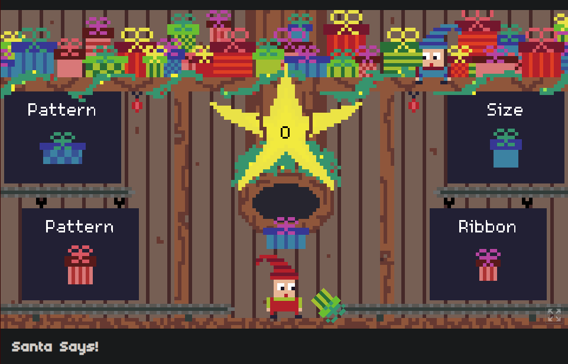

**这款游戏的核心玩法是：** *每隔一段时间玩家头顶会掉下一个有着不同彩纸、彩带、尺寸、纹理的礼盒，四周有4个传送带指向4个舱门，每个舱门上都有一个指示牌，上面画着一个礼盒，旁边写着一个关键字（彩纸/彩带/尺寸/纹理），你需要根据这个指示，将礼盒送到匹配指示牌上礼盒的关键字部位的舱门。*

我认为这个游戏作为一个游戏原型而言相当有趣，于是就借鉴了其中对礼盒样式进行筛选的玩法。

**NameYourGift**在festive-frenzy的游戏基础之上，加入了santa-says的部分要素，**设计了最终的玩法：**

- **收集制作礼盒的道具**——彩纸、礼花、礼物，将它们带到合成砧，合成为礼盒。
- 这回不仅仅要考虑礼盒的制作，还要**考虑送礼对象**，你要根据孩子们寄来的信件，来判断他们对应的礼物：
    - 孩子们的信件包含如下信息：
        - 他们的想法、希望或者烦恼，孩子们不会直接向你说明他们想要的礼物，但**你需要根据他们的描述来推测他们可能需要的礼物。**
        - 他们喜欢的彩纸、彩带、纹理，你需要**将礼盒定制为他们喜欢的样子。**
- 玩家需要带着礼盒，与小精灵进行对话，**对话内容会透露与礼物相关的信息**，玩家可以根据对话信息进一步判断与礼物匹配的孩子。
- 玩家将制定好样式的礼盒丢到雪橇车中，如果匹配正确，则系统判断礼物打包成功
- **为所有孩子打包好礼物，游戏胜利。**


### 问题3：这款游戏希望达成的目标是什么？

**答：** **为了利用自己目前所学，完完整整做一款游戏。**

这个目标也算是达到了，作为初心者希望能多做一些完整度比较高的小Demo，

要笔者自己说，NameYourGift跟【好玩】可差得远了，美术风格也没有什么出众的，**是一款没有任何特色的小Demo，**

但在制作中，笔者自己能在枯燥的学习过程中体验到游戏开发的乐趣，这点就足够了。

当然，在玩法设计、玩家调研、概念设计、游戏理念、技术选型、美术设计、游戏测试、游戏发行、市场推广等等方面，我全都知之甚少，但凡事总是要有个开始。

*还有个很重要的目的，就是用这款游戏来庆祝2024年圣诞节 ~~（乐就完了）~~*

## 📖第二步：开发

### 🛠开发工具&&准备工作

- 游戏编辑器：*Cocos Creator 2.4.10*
- 代码编辑器：*VSCode*
- 像素画绘制：*Aseprite v1.3.10.1*
- 精灵图处理：*TexturePacker*
- 图片处理：*Photoshop 2019*
- 操作系统：*Windows 10*
- 进度记录工具： *Notion*
- 素材整理工具：*Eagle*

关于cocos的学习，主要是通过2个课程进行：

- [CocosCreator入门教程之2D游戏开发【持续更新—第23集】](https://www.bilibili.com/video/BV11W4y1T7ip/?spm_id_from=333.337.search-card.all.click&vd_source=f55c755ba9aae4a4382a0f9d56858d01)
- [【Cocos教程-游戏开发】2D横板角色移动-攻击-跳跃-冲刺-闪避](https://www.bilibili.com/video/BV1rf4y1T73d/?spm_id_from=333.337.search-card.all.click&vd_source=f55c755ba9aae4a4382a0f9d56858d01)

### ⚙️实现过程

开发结束后review了代码，有些地方的实现都相当粗糙，

像角色移动、物体交互这种功能，一定有更成熟稳定的脚本实现方式，因此这里介绍的各种实现方式，都不是最好的实现方法，有进一步优化的空间。

#### 🗺️地图场景搭建

推荐2个b站视频：

- [【无废话教程】在Tiled中制作动画瓦片图并导入Cocos Creator引擎](https://www.bilibili.com/video/BV1P54y1F78b/?spm_id_from=333.1007.top_right_bar_window_history.content.click&vd_source=f55c755ba9aae4a4382a0f9d56858d01)
- [【Cocos教程】如何实现人物与墙壁间的碰撞？](https://www.bilibili.com/video/BV16E411M74V/?spm_id_from=333.1007.top_right_bar_window_history.content.click&vd_source=f55c755ba9aae4a4382a0f9d56858d01)

笔者最初摸索cocos引擎时，知道有TileMap这个东西，学习Unity的时候用过TileMap编辑器，但是到了cocos这里，关于TileMap的介绍很少，看官网文档介绍，需要引入Tiled编辑器导出的.tmx的文件。

当时非常摸不着头脑，摸索了一下Tiled编辑器，感觉比较复杂，不是一下就能走通的，于是就不愿意用TileMap继续进行地图编辑了。

于是选择了最麻烦的一种方法：直接上手用瓦片一砖一瓦把地图垒起来，然后手动编辑地图包围盒 ~~（自己看到都无语的程度）~~ 。

也亏是地图小，一开始叫我垒成功了，因为这个奇葩操作，导致后面很多莫名其妙的问题，比如：我利用玩家与地面碰撞的法向量y值是否等于-1来判断玩家跳跃是否站立在地面上，但效果总是不好，后来发现是因为我自定义的地面包围盒不完全是水平地面的原因（存在斜度）

之后看了这两篇教程，**一篇介绍如何将Tiled中制作的动画瓦片图导入Cocos Creator，一篇介绍如何使用代码方式给TileMap添加碰撞盒**，但跟Unity的TileMap Collider2D比起来，感觉cocos还是麻烦很多。


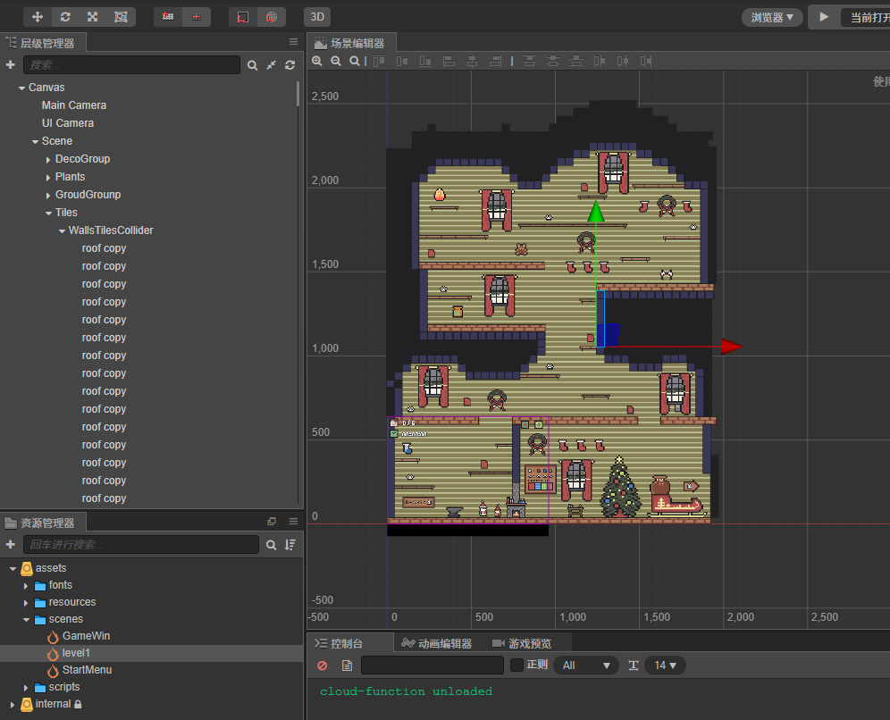


#### 🚶🏻‍♂️角色水平移动


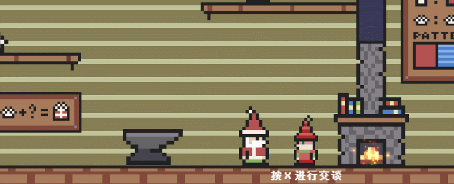

根据A/D键的输入，判断Player的朝向，并**给Player的RigidBody一个线性速度**：
```typescript
@ccclass
export default class PlayerMove extends cc.Component {
  // 走路速度
  walkSpeed: number = 0;
  // 初始走路速度
  initWalkSpeed: number = 0;
  // 最快走路速度
  maxWalkSpeed: number = 350;
  // 朝向
  dir: number = 1;
  // 刚体
  rbBody: cc.RigidBody = null;
  onLoad() {
    this.rbBody = this.node.getComponent(cc.RigidBody);
  }
  start(){
    cc.systemEvent.on(
      cc.SystemEvent.EventType.KEY_DOWN,
      (event: cc.Event.EventKeyboard) => {
          switch(event.keyCode){
              case cc.macro.KEY.a:
              case cc.macro.KEY.left:
                // 向左移动
                this.setFaceDir(-1);
                this.move();
                break;
              case cc.macro.KEY.d:
              case cc.macro.KEY.right:
                // 向右移动
                this.setFaceDir(1);
                this.move();
                break;
          }
      }
    )
  }
  move(dir){
    let v = this.rbBody.linearVelocity;
    // 逐渐加大加速度，直到最大值200
    if(this.walkSpeed < 200){
      this.walkSpeed += 2;
    }
    // 存在一个速度最大值
    if (Math.abs(v.x + this.walkSpeed * this.dir) < this.maxWalkSpeed) {
      v.x += this.walkSpeed * this.dir;
    } else {
      v.x = this.maxWalkSpeed * this.dir;
    }
    this.rbBody.linearVelocity = v;
  }
  
  // 设置朝向
  setFaceDir(dir) {
    // 转向
    if (this.dir !== dir) {
      this.dir = dir;
      // 转向时加速度变为初始值
      this.walkSpeed = this.initWalkSpeed;
      if (this.dir == 1) {
        // 向右
        this.node.scaleX = 1;
      } else {
        // 向左
        this.node.scaleX = -1;
      }
    }
  }
}

```

此时，Player的移动依旧是存在问题的，因为移动事件是在**KEY_DOWN**中触发并被调用的，**如果长按A/D键，KEY_DOWN仅会被调用一次**，角色也就仅会移动一小下，但我希望看到的是长按时角色加速移动。

**因此这里就要配合KEY_UP事件和按键记录哈希表进行实现：**
- 参考帖子：[cocos creator 组合键怎么用？](https://forum.cocos.org/t/topic/76396)

具体思路就是在KEY_DOWN监听到按键按下时，在哈希表中将这个按键的状态置为激活，在KEY_UP监听到按键被松开时，再将按键重置。

在update中对哈希表的属性值进行轮询，**发现有处于激活状态的按键就调用对应的按键方法：**

```typescript
  // 当前按下的键
  pressKeys = [];  
  onLoad() {
    this.pressKeys = []
  }
  start(){
    cc.systemEvent.on(
      cc.SystemEvent.EventType.KEY_UP,
      (event: cc.Event.EventKeyboard) => {
        // 按键重置
        this.pressKeys[event.keyCode] = false;
      }
    );
    cc.systemEvent.on(
      cc.SystemEvent.EventType.KEY_DOWN,
      (event: cc.Event.EventKeyboard) => {
        // 按键被激活
        this.pressKeys[event.keyCode] = true;
      }
    );
  }
  update(dt){
      // 检查pressKeys按键表
      this.checkKeyboard()
  }
    // 检查按键
  checkKeyboard(){
    for (let [key, value] of Object.entries(this.pressKeys)) {
        if (value == false) continue;
        let keyCode = Number(key);
        switch (keyCode) {
          case cc.macro.KEY.a:
          case cc.macro.KEY.left:
            // 向左移动
            this.setFaceDir(-1);
            this.move();
            break;
          case cc.macro.KEY.d:
          case cc.macro.KEY.right:
            // 向左移动
            this.setFaceDir(1);
            this.move();
            break;
          case cc.macro.KEY.w:
          case cc.macro.KEY.up:
            // 跳跃
            this.jump();
            break;
        }
      }
  }
```

#### 📷角色跳跃与相机跟随

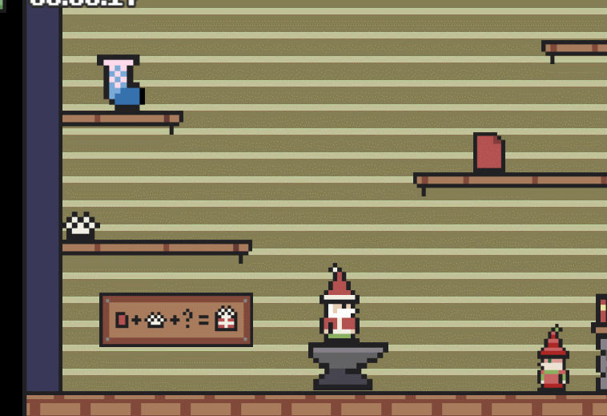

角色跳跃中最好实现的就是跳跃动作本身，**给Player的RigidBody一个沿y轴朝上的linearVelocity线性速度**即可：

```typescript
  // 是否可以跳跃
  jumpEnable: boolean = true
  // 跳起的线性速度
  jumpSpeed: number = 800;

  // 跳跃
  jump() {
    if(!this.jumpEnable) return
    let v = this.rbBody.linearVelocity
    v.y = this.jumpSpeed
    this.rbBody.linearVelocity = v
    this.jumpEnable = false;
  }
```
但是需要注意的是，**如何判断Player现在是否可以跳跃**，因为Player只有在确认双脚在地上时才能进行下次跳跃，要不就左脚踩右脚原地飞升了。

**判断的方法是检测碰撞的法向量的y值是否小于0**，小于0说明此时地面在低于Player的方向：
```typescript
// 检测与地面之间的碰撞
onBeginContact(contact, self, other){
    // 当前接触到地面，可以跳起
    let group = other.node.group
    if(other.tag == CollisionTags.ground && self.tag == playerCollistionTags.move){
        // 从上至下落下
        let normal = contact.getWorldManifold().normal
        if(normal.y < 0){
          this.jumpEnable = true
        }
    }
}
// 检测玩家双脚离地
onEndContact(contact, self, other){
   // 离开地面，无法跳起
   if(other.tag == CollisionTags.ground && self.tag == playerCollistionTags.move){
       // 离开脚下的物体
       let normal = contact.getWorldManifold().normal
       if(normal.y < 0){
          this.jumpEnable = false
       }
   }
}
```

相机跟随这里进行了**高度控制**：

- 以半个屏幕的高度（也就是Canavs的原点高度）为高度跟随节点P，划分整个场景
- 角色在P点以下位置，相机不跟随高度
- 角色在P点以上位置，相机跟随高度
- 相机缓动跟随

```typescript
// 目标相机位置
  cameraTarget = {
    x:0,
    y:0,
  }
  cameraStep = 8 // 控制缓动平滑度
  // 增加一个缓动效果
  updateCamera(){
    if(window.game.camera.x !== this.cameraTarget.x){
      window.game.camera.x += (this.cameraTarget.x - window.game.camera.x)/this.cameraStep
    }
    if(window.game.camera.y !== this.cameraTarget.y){
      window.game.camera.y += (this.cameraTarget.y - window.game.camera.y)/this.cameraStep
    }
  }
  // 相机跟随
  cameraFollow() {
    // 跟随x坐标
    this.cameraTarget.x = this.node.x
    if(this.node.y <= 0){
        // 节点在Canvas中心以下，则以Canavs为中心
        this.cameraTarget.y = 0
    }else{
        // 节点高于Canavs中心，开始跟随
      this.cameraTarget.y = this.node.y + scrollHeight;
    }
  }
```


#### 📦️物体抬举与抛出

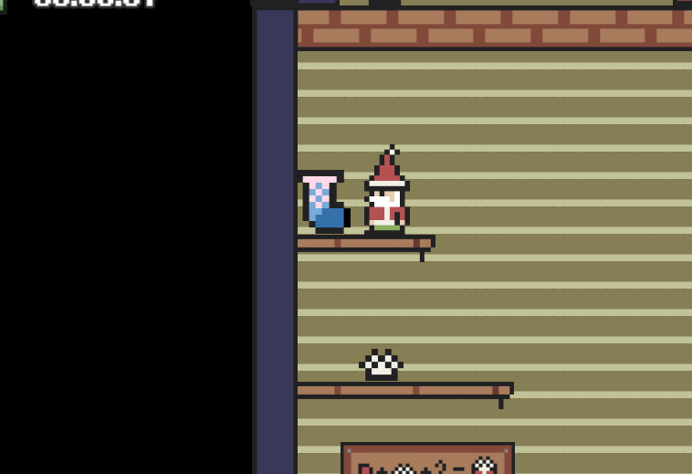
物体中存在几种可抬举的物品，这里**使用Gourp对这些物品的Node进行标识**。

**Player需要一个数组，用于存放当前附近可抬举的物品**，这个数组在碰撞检测中进行刷新,
当可抬举物品被Player触碰到时，就被纳入数组之中，当碰撞结束时，再被从数组中清除：
```typescript
    // 碰撞盒检测
    onBeginContact(contact, self, other){
        // 判断是否是可交互物品，是否是交互探测碰撞盒检测到的碰撞
        if(pickableList.includes(other.node.group) && self.tag == playerCollistionTags.pick){
            
            // 检测是否已经存在这个物品
            if(this.pickItemList.findIndex(item=>item.uuid == other.node.uuid) < 0){
                // 推入该物品
                this.pickItemList.push(other.node)
            }
        }
    }
    onEndContact(contact, self, other){
        if(pickableList.includes(other.node.group) && self.tag == playerCollistionTags.pick){
            // 从数组中过滤掉
            this.pickItemList = this.pickItemList.filter(item=>other.node.uuid !== item.uuid)
        }
    }
```

**当Player监听到抬举命令时，首先判断手中有没有物品**，如果有，下一步动作则是将物品抛出去，如果没有，则会从可抬举物品队列中挑出队首物品举起。

这里**需要给抬举/抛出动作一个CD间隔**，让它无法被连续触发，因为这样会导致Player将刚刚从手中抛出的物品又抬举回来的动作：

```typescript

    // 物品收集的CD
    pickingCD = 0
    // 是否可以捡起
    pickable:boolean = false
    // 被捡起来的物品
    pickItemList:cc.Node[] = []
    // 捡起物品
    pickup(){
        if(this.pickingCD>0) return
        this.pickingCD = 20
        // 如果手中有物品，丢出去
        if(this.pickingItem) {
            this.throwOut()
            return
        }
        if(this.pickItemList.length > 0){
            // 抬举物品
            this.pickingItem = this.pickItemList.shift()
            this.lift()
        }
    }
    update(){
        // CD冷却
        if(this.pickingCD > 0){
            this.pickingCD --
        }
    }
```

举起物品和抛出物品是两种截然相反的动作：
- 举起物品：*切换举起贴图，被举起物的RigidBody失效，物品坐标定位到Player的头顶位置*
- 抛出物品：*切换正常贴图，恢复物品RigidBody，并给它一个和玩家朝向相同的linearVelocity线性速度作为抛出力*

```typescript
    // 丢出物品
    throwOut(){
        // 切换贴图
        this.toggleSprite('normal')
        // 检查当前玩家的朝向，向指定朝向丢出物品
        const pm = this.node.getComponent(PlayerMove)
        const dir = pm.dir
        // 此处顺序不能颠倒，否则受力失败
        const pickRb = this.pickingItem.getComponent(cc.RigidBody)
        pickRb.enabled = true
        this.pickingItem.getComponent(cc.PhysicsPolygonCollider).enabled = true
        let v = pickRb.linearVelocity
        pickRb.gravityScale = 1
        v.x = 300* dir
        v.y = 300
        pickRb.linearVelocity = v
        this.pickingItem = null
    }
    // 举起物品
    lift(){
        // 切换贴图
        this.toggleSprite('pick')
        let pickRb = this.pickingItem.getComponent(cc.RigidBody)
        // 将线性速度、角速度控制为0
        // 即便是把刚体撤离之后，物体依旧会按照原本的角速度运动
        pickRb.linearVelocity.x = 0
        pickRb.linearVelocity.y = 0
        pickRb.angularVelocity = 0
        pickRb.gravityScale = 0
        pickRb.enabled = false
        this.pickingItem.getComponent(cc.PhysicsPolygonCollider).enabled = false
        // 坐标定到头顶位置
        this.pickingItem.x = this.node.x
        this.pickingItem.y = this.node.y + this.pickingItem.height
    }
```

#### 🧰礼物合成

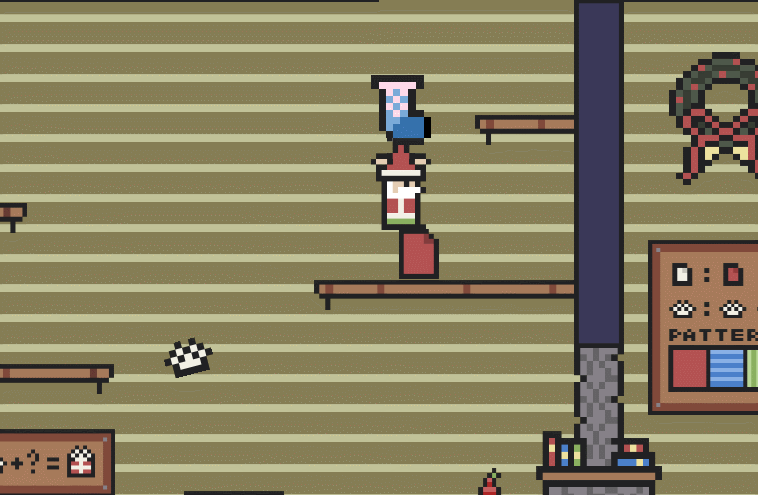

合成一个礼盒，一共需要三种原料，并且每种原料仅仅需要一种。

因此合成台就有三个空位，分别留给彩纸、彩带、礼物类型的节点，
如果监听到有节点进入了它的检测圈，并且是可以用于合成的材料类型，合成台就会继续检测材料对应的合成席位有没有被占用，

**如果没有，则就将目标材料纳入席位，如果有，则目标材料作为备用材料进入待合成材料队列中。**

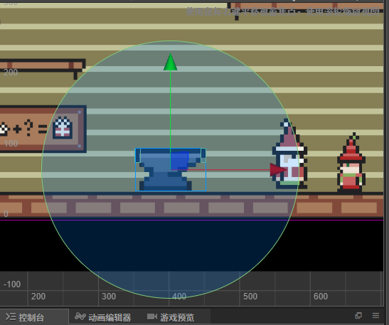

*合成台吸入碰撞检测：*
```typescript
  // 存放当前包围圈里可以被使用的材料
  contactMats = [];
  // 碰撞监听
  onBeginContact(contact, self, other) {
    // 不是合成包围盒监听到的碰撞
    // 不是原材料的，返回
    if (self.tag != 1 || !materialGroupList.includes(other.node.group)) return;
    // contactMat中已经存在的，返回
    if (this.contactMats.find((item) => item.uuid == other.node.uuid)) return;
    // 装载的材料中已经存在的，返回
    if (Object.values(this.mat).find((item) => item?.uuid == other.node.uuid))
      return;

    this.contactMats.push(other.node);
  }

  onEndContact(contact, self, other) {
    // 已经装载的材料，不用再判断了
    if (Object.values(this.mat).find((item) => item?.uuid == other.node.uuid))
        return;
    
    // 剔除
    this.contactMats = this.contactMats.filter(
      (item) => item.uuid != other.node.uuid
    );
  }
```

*有了一个存放可合成物的数组之后，就可以在update中进行装填了，也就是做材料物匹配：*

```typescript
// 初始材料席位
initMaterial = {
  // 礼物
  gift: undefined,
  // 纸张
  papper: undefined,
  // 丝带
  ribbon: undefined,
  // 材料集齐总数
  count: 0,
};
// 材料席位
mat = {...initMaterial};
 // 对号入座
  preload() {
    let cm = [...this.contactMats]
    for (let material of cm) {
      let load = false
      switch (material.group) {
        case "Gift":
          if (!this.mat.gift) {
            this.mat.gift = material;
            load = true
          }
          break;
        case "Papper":
            if(!this.mat.papper){
                this.mat.papper = material;
                load = true
            }
          break;
        case "Ribbon":
            if(!this.mat.ribbon){
                this.mat.ribbon = material
                load = true
            }
          break;
      }
      // 有新材料被填入
      if(load){
        this.mat.count++
        // 将已填入的材料从预备列表中提出
        this.contactMats = this.contactMats.filter(item=>item.uuid != material.uuid)
        // 纳入席位的材料重力变为0
        let matRb = material.getComponent(cc.RigidBody)
        matRb.gravityScale = 0
        let v = matRb.linearVelocity
        v.x = 0
        v.y = 0
        matRb.linearVelocity = v
        let matCol = material.getComponent(cc.PhysicsPolygonCollider)
        matCol.enabled = false
        matRb.enabled = false
      }
      // 三个席位全满，结束预装填
      if(this.mat.count>=3){
        break;
      }
    }
  }
```

*被纳入席位的材料会围绕着工作台上方的合成点进行旋转：*

```typescript
  // 合并阶段的旋转速度
  mergingSpinSpeed = 2;
  // 合并/被吸入的速度
  mergeSpeed = 0.5;
  // 旋转
  spin(){
    let spinItems = Object.values(this.mat).filter(item=>{
        return item && item instanceof cc.Node
    })
    spinItems.forEach(item=>{
        // 计算材料相对合成点（圆心）的坐标
        let diffX = item.x - this.center.x
        let diffY = item.y - this.center.y
        let distance = Math.sqrt(diffX ** 2 + diffY ** 2)
        // 计算弧度
        let radian = Math.atan(diffY / diffX)
        // 弧度转角度
        let angle = radian * 180 / Math.PI
        if(diffX < 0) angle+=180
        if(angle < 0) angle += 360
        angle += this.spinSpeed
        radian = angle * Math.PI / 180

        distance -= this.mergeSpeed
        let r = distance > this.spinRadius? distance: this.spinRadius
        item.x = this.center.x + r * Math.cos(radian)  
        item.y = this.center.y + r * Math.sin(radian)  
    })
  }
```

当三个席位都有对应的材料时，**开始合并，此时材料的旋转半径开始逐渐减小，材料被卷入合成点，直到超过最小半径阈值时，判定合成结束，生成礼盒：**

```typescript
  // 合并状态：集齐3个材料，材料们开始向内被吸入，旋转速度加速
  isMerge = false;
  // 最小的旋转半径（小于这个值判断为合成结束）
  minRadius = 5;
  // 合并/被吸入的速度
  mergeSpeed = 0.5;
  // 开始合并
  merge(){
    // 收缩
    this.spinRadius -= this.mergeSpeed
    // 缩到最小数值
    if(this.spinRadius < this.minRadius){
        this.mergeEnd()
    }
  }
  // 合并结束
  mergeEnd(){
    // 此处应该生成一个新的礼物
    this.generateGift(this.mat.gift)
    this.mat.gift.active = false
    this.mat.papper.active = false
    this.mat.ribbon.active = false
    // this.mat = JSON.parse(JSON.stringify(initMaterial))
    this.mat = {...initMaterial}
    this.spinRadius = initSpinRadius
    this.spinSpeed = initSpinSpeed
    this.isMerge = false
  }
  // 生成礼物
  generateGift(gift){
    // 根据礼物的尺寸获取礼物盒，此处关于礼物prefab略
    const giftPrefab = this.giftBoxPrefab[gift.getComponent(Gift).size]
    const newGiftBox = cc.instantiate(giftPrefab)
    let giftBoxCom = newGiftBox.getComponent(GiftBox)
    giftBoxCom.setGift(gift)
    newGiftBox.x = this.center.x
    newGiftBox.y = this.center.y
    newGiftBox.setParent(this.giftBoxGroup)
  }
```

*从预装材料到合并，需要在update中进行检测：*

```typescript
  update() {
    this.spinSpeed = initSpinSpeed
    if (this.mat.count < 3) {
      this.preload(); // 预装
    }else{
      this.spinSpeed = this.mergingSpinSpeed
      this.merge() // 合并
    }
    if(this.mat.count>0){
        this.spin() // 旋转
    }
  }
```

#### 🎁礼盒定制
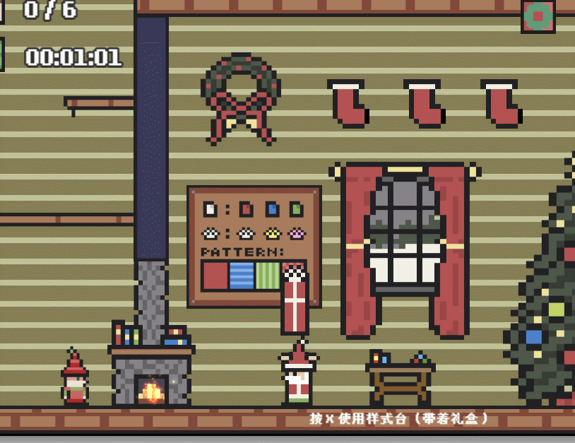

礼盒定制的主要问题就是，所有搭配的礼盒样式，都要有它对应的资源图片，**按照某种规则命名：**

> *尺寸-彩纸颜色-彩带颜色-纹理*

在样式编辑菜单结束后，生成礼盒样式对应的图片资源的名称，然后使用cc.resources.load进行动态加载：
```typescript
    // 重新加载贴图
    resetSprite(){
        /**
         * 贴图命名模版
         * 盒子尺寸-盒子颜色-丝带颜色-盒子纹理
         * 大-蓝-白-纯色
         */
        let name = [
            SizeType[this.size],
            ColorType[this.color],
            RibbonColorType[this.ribbonColor],
            PatternType[this.pattern]
        ].join('-')
        cc.resources.load(`imgs/boxes/${name}`,cc.SpriteFrame, (error:Error, assets:cc.SpriteFrame)=>{
            if(error){
                console.log(error)
                return
            }
            this.node.getComponent(cc.Sprite).spriteFrame = assets
            this.isMerge && this.playChange()
        })
    }
```

#### 🛷礼盒匹配检测

当礼物盒检测到与雪橇的碰撞时，会检测孩子数据库中是否存在与该礼物盒匹配的数据，**如果存在，则判定礼物包装成功，不存在则判定失败，并添加一个反弹的力：**
```typescript
 // 开始碰撞
    onBeginContact(contact, self, other){
        if(!this.isMerge) return
        if(this.done) return
        // 检测是否是雪橇车的礼物检测碰撞盒
        if(other.tag == 3 && other.node.name == 'SnowCar'){
            let success = false
            // debugger
            // 对礼物组合进行判定
            let data = window.game.childList.json.data
            for(let i = 0; i< data.length; i++){
                let child = data[i]
                // 已经包装完毕
                if(child.isDone) {
                    continue
                };

                let giftList = window.game.globalDict.json.gift
                let wish = giftList.find(item=>item.value == child.gift)
                // 礼物不一致
                if(wish.name !== this.gift.name) continue;
                if(
                    child.papper == this.color &&
                    child.ribbon == this.ribbonColor &&
                    child.pattern == this.pattern 
                ){
                    // 判定礼物分配结束
                    child.done = true
                    success = true
                    this.node.group = "default"
                    break;
                }
            }
            if(success){
                this.done = true
                let collider = this.node.getComponent(cc.PhysicsPolygonCollider)
                collider.density = 1000
                collider.friction = 1000

            }else{
                // 施加一个向外的力
                const rb = this.node.getComponent(cc.RigidBody)
                let v = rb.linearVelocity
                v.x = -300 
                v.y = 300
                rb.linearVelocity = v
            }
        }
    }
```

*检测成功效果：*


*检测失败效果：*

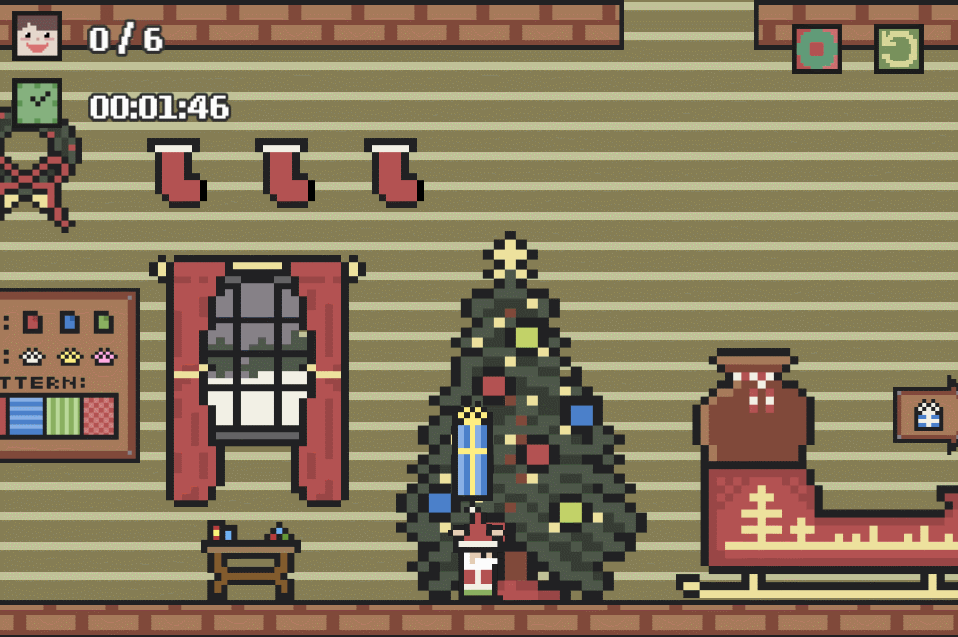

#### 🗨对话系统

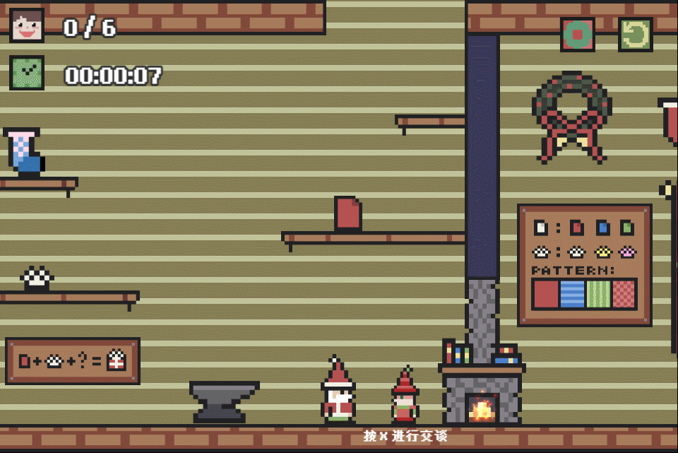

**对话交互的整个实现流程：**

1. 触发角色对话
2. 切换对话中UI
3. 根据当前游戏状态判断载入的游戏脚本
4. 绑定对话时键盘事件
5. 模拟打字字幕效果
6. 当前语句结束，加载下一句话
7. 所有对话加载完，对话结束


*第一步：触发与NPC之间的对话，切换对话UI：*
```typescript
    // 和NPC说话
    talk(){
        // 游戏暂停
        window.game.Pause()
        // 切换对话中UI
        this.ToggleTalkUI(true).then(res=>{
            // UI切换好之后进入对话
            this.startLoadTalk()
        })
    }
```

*第二步：载入当前对话*
```typescript
    // 加载对话
    startLoadTalk(){
        // 下面一系列分支用于判断当前应该进行的对话内容
        if(!this.hasInitTalked){
            // 如果没有经过开场对话，加载开场对话脚本
            this.curScript = this.initScript
            this.hasInitTalked = true
        }else if(this.isGameEndTalk){
            // 此时游戏已经结束，加载结束对话
            this.curScript = this.gameEndTalk
        }else{
            // 正在捡起的物品
            let pickingItem = this.pickComp.pickingItem
            let group = pickingItem?.group
            // 如果是手上拿着礼物或者是礼物盒，加载礼物对应的脚本
            if(group == 'Gift'){ // 是礼物，直接加载脚本
                this.curScript = pickingItem.getComponent(Gift).script.json
            }else if(group == 'GiftBox'){
                let gift = pickingItem.getComponent(GiftBox).gift
                this.curScript = gift.getComponent(Gift).script.json
            }else{
                // 如果是其它情况，则加载随机对话
                this.curScript = this.randomTalkScript[this.randomTalkIndex]
                this.randomTalkIndex = (this.randomTalkIndex + 1) % this.randomTalkScript.length
            }
        }
        // 重置对话内容
        this.loadNextWord(null)
        // 绑定对话键盘事件
        cc.systemEvent.on(
            cc.SystemEvent.EventType.KEY_UP,
            this.loadNextWord,
            this
        )
        
    }
```

*第三步：对话中的键盘事件、模拟打字与对话结束*

此处的关键点在于：对话结束后，**一定要对此次对话开始时绑定的键盘事件进行解绑定**，因为如果不解绑，就会在下次对话事件被触发时再次绑定一次对话事件，相当于同一个键盘操作对应2个已经被绑定的键盘事件，当触发【下一句话】的操作时，实际会执行2次【载入下一句话】操作，**就会出现跳句现象**。


```typescript
    loadNextWord(event:cc.Event.EventKeyboard){
        const talkEnd = ()=>{
            this.curScript = null
            // 一定要对已经绑定的对话事件解绑
            cc.systemEvent.off(
                cc.SystemEvent.EventType.KEY_UP,
                this.loadNextWord,
                this
            )
            // 结束对话
            this.stopTalk()
        }

        // 输入的是空格，跳过对话
        if(event && event.keyCode == cc.macro.KEY.space){
            talkEnd()
            this.typingLocation = 0
            this.targetContent = ''
            return 
        }

        if(event && event.keyCode !== cc.macro.KEY.e) return
        // 字还没有打完，按E直接显示全部对话
        if(this.tCLabelCp.string.length !== this.targetContent.length) {
            this.typingLocation = this.targetContent.length
            this.tCLabelCp.string = this.targetContent
            // 此处清空的是模拟打字中用到的延时器
            clearTimeout(this.typingTimer)
            return
        }
        this.typingLocation = 0
        this.targetContent = ''
        // 代表一句话已经加载完
        if(this.curTalkIndex >= this.curScript.data.length) {
            this.curScript = null
            talkEnd()
            return
        }
        // 加载下一句话
        let wordData = this.curScript.data[this.curTalkIndex]
        // 获取说话者信息
        let talker = this.curScript.chara.find(item=>item.id == wordData.talker)
        // 将说话者名字载入名字Node中
        this.tNameLabelCp.string = talker.name[window.globalData.lang]
        this.talkerNameLabel.color = new cc.Color(...talker.color)
        // 说话人音效
        this.talkerSound = talker.sound

        // 此处插入一个打字特效
        this.targetContent = wordData.content[window.globalData.lang]
        this.tCLabelCp.string = ''
        // 模拟打字效果
        this.simTyping()

        this.curTalkIndex ++
    }
        // 打字速度
    typingSpeed:number = 100
    // 打字位置记录
    typingLocation:number = 0
    // 目标打字内容
    targetContent:string = ''

    typingTimer = null
    // 模拟打字
    simTyping(){    
        window.globalData.playSound(this.talkerSound)
        this.tCLabelCp.string += (this.targetContent[this.typingLocation] || '')
        this.typingLocation ++
        if(this.typingLocation < this.targetContent.length){
            this.typingTimer = setTimeout(()=>{
                this.simTyping()
            },this.typingSpeed)
        }
    }
    // 停止说话，谈话结束
    stopTalk(){
        // 退出对话UI
        this.ToggleTalkUI(false).then(res=>{
            // 游戏继续
            window.game.Continue()
            this.curTalkIndex = 0
            this.tNameLabelCp.string = ''
            this.tCLabelCp.string = ''
            this.targetContent = ''
        })
    }
```

### 🔎其他问题

#### 🧩全局状态管理

**单一场景内多个节点的共享的状态**，使用一个单一场景脚本类Game进行控制，将Game挂载到Canvas节点上，然后存放到浏览器的window中、

**多个场景共享的状态，** 存放在入口场景中的globalData节点中，将该节点通过*cc.game.addPersistRootNode*进行保存，可以在多个场景内访问到，用于存放一些游戏总状态、总设置参数。

#### 🌲场景切换问题

如果需要从A场景切换到B场景，**需要销毁A场景中绑定的全局事件**，否则之前绑定的事件依然会被正常调用：
```typescript
  // 如果不销毁绑定的事件，切换场景调用的是被销毁节点上的脚本
  onDestroy(): void {
    cc.systemEvent.removeAll(cc.SystemEvent.EventType.KEY_DOWN)
    cc.systemEvent.removeAll(cc.SystemEvent.EventType.KEY_UP)
  }
```

#### ⌨️事件绑定问题

- 参考博客：[游戏开发-cocos creator踩坑-bind(this)导致的事件监听off不掉](https://www.cnblogs.com/orxx/p/10941079.html "发布于 2019-05-28 23:20")

在绑定对话键盘事件时，最初使用的是bind绑定事件的this：
```typescript
        cc.systemEvent.on(
            cc.SystemEvent.EventType.KEY_UP,
            this.loadNextWord.bind(this)
        )
```
但是通过bind绑定的每次都是新的事件，无法正常进行解绑。

需要用另一种方式来对全局事件进行绑定和解绑定：
```typescript
        // 事件绑定
        cc.systemEvent.on(
            cc.SystemEvent.EventType.KEY_UP,
            this.loadNextWord,
            this
        )
        // 事件绑定
        cc.systemEvent.off(
            cc.SystemEvent.EventType.KEY_UP,
            this.loadNextWord,
            this
        )
```

#### 🖱防止Click事件穿透

上层菜单弹出后，被遮住的按钮依旧能正常触发，需要给不希望被穿透的节点添加[BlockInputEvents组件](https://docs.cocos.com/creator/2.4/manual/zh/components/block-input-events.html)


### 📅完整版开发日志

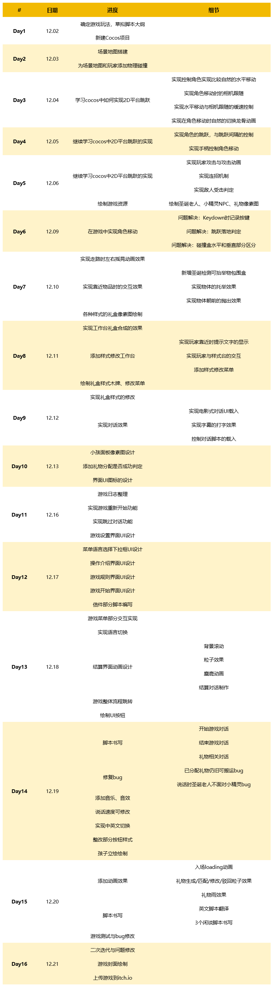


## 🏁第三步：上架

- 参考：[如何上传你的游戏到itch.io？(含上传页面的翻译)](https://zhuanlan.zhihu.com/p/40875481)

最后上架游戏到itch.io,

官方推荐的封面图是**630*500，**

如果是h5游戏，上传包内的文件数量**不允许超过1000个，**

所以在上传之前最好清理一下项目文件夹


## 🔚项目总结

1. 最深刻的总结就是：**一定要针对每个功能，设计单元测试！**
    - 不然到了游戏后期，所有流程已经串起来之后，再想改一个游戏中的一个部分会非常痛苦
    - 这部分还在摸索中...
2. 在**全局数据规划和控制**方面比较混乱
3. 这仅是一个只有一个主场景的小游戏，**实际上没有涉及任何复杂的设计。**
4. 根据玩家的实际反馈，**游戏在引导方面做的不好，** 玩家的游戏体验没有预想的流畅。

# 💐游戏资源

游戏中使用到的都是开源社区创作者们分享的素材资源：
-   **美术资源：**

    -   大部分来自于**WilliamBilliam**的开源美术资源包[festive-frenzy-sprite-sheet](https://williambilliam.itch.io/festive-frenzy-sprite-sheet)，并在此基础上进行了部分扩展。
    -   图标资源来自于itch.io上的创作者**PiiiXL的开源美术资源包**[1-bit-icons-part-2](https://piiixl.itch.io/1-bit-icons-part-2)
    -   操作说明的键盘图标资源来自于itch.io上的创作者**xPheRe的开源美术资源包**[pixel-keyboard-layout](https://xphere.itch.io/pixel-keyboard-layout)
    -   麋鹿动画来自于lapizwcg的开源美术资源包[the-minifolks-forest-animals-deer-doe-free-32x32-mod-by-lapizwcg](https://lapizwcg.itch.io/the-minifolks-forest-animals-deer-doe-free-32x32-mod-by-lapizwcg)

-   **字体资源：** [Uranus-Pixel](https://github.com/scott0107000/Uranus-Pixel)

-   **音效资源：** 音乐和音效来自于FreeSound上的创作者[rhodesmas](https://freesound.org/people/rhodesmas/)和创作者[AudioCoffee](https://freesound.org/people/AudioCoffee/)的开源分享。
-  [项目github源码](https://github.com/PUYIXIU/NameYourGift)
